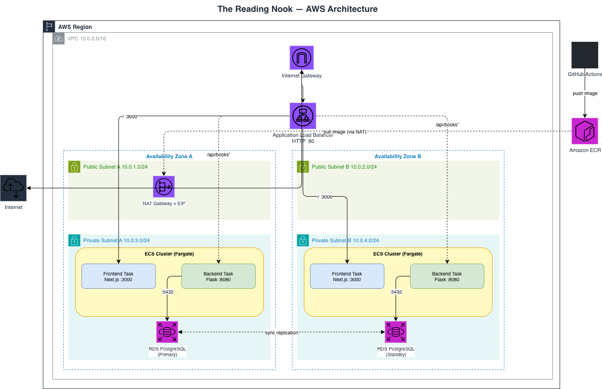
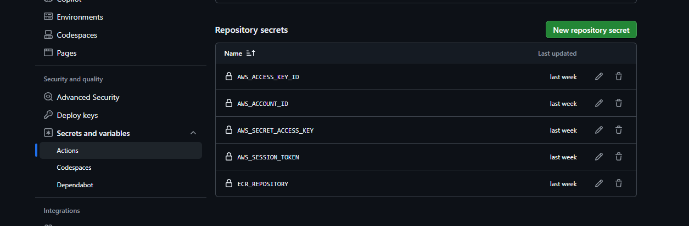
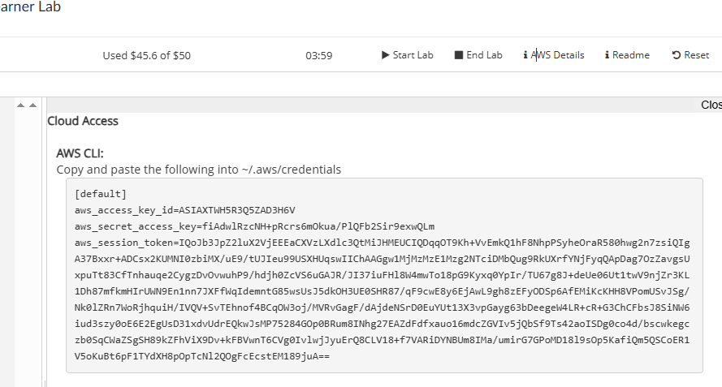
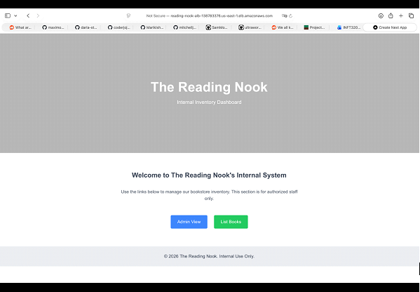

### If you want to, you would be able to try it yourself:

### First, get the.YAML file in this repo contains the entire script of the project's infrastructure that looks like this(it will take at least 20 mins to build):

### This script generates this architecture:

### Then go to this repo and add your credentials for the pipeline:

### https://github.com/mitchelljordan/inft3200-frontend-main

### Learner Labs example:

### Finally, make a commit that does not break the website, and take a look at the website(this will only show the frontend; this does not have the backend or the DB):

